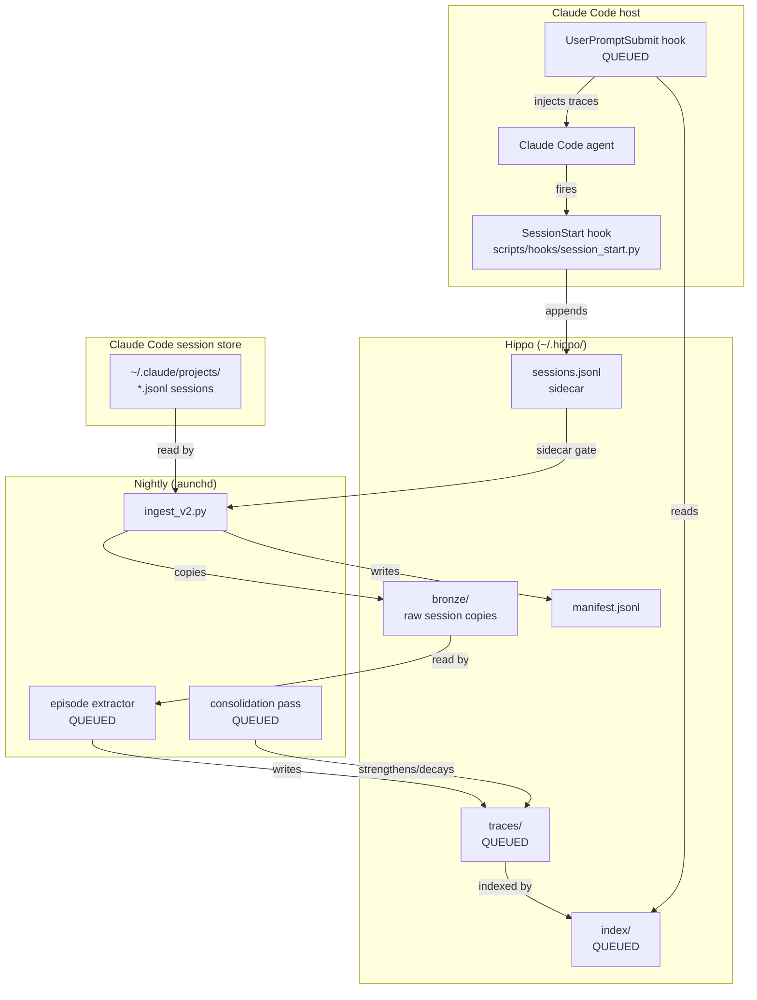

# Section 3: System Scope and Context

## System Boundary

Hippo is a local background service co-located with Claude Code on the user's laptop. It has no
network presence of its own. All external interactions are either filesystem reads/writes or
`claude -p` subprocess calls.

## External Interfaces

| Interface | Direction | Protocol | Notes |
|-----------|-----------|----------|-------|
| `~/.claude/projects/` | Read | filesystem | Source of raw session JSONL files |
| `~/.claude/settings.json` | Read | JSON | Hook registration |
| `claude -p` subprocess | Outbound | stdin/stdout | Used by episode extractor for LLM extraction |
| launchd plist | Inbound | macOS launchd | Triggers nightly ingest |
| `HIPPO_HOME` env var | Configuration | shell env | Overrides default `~/.hippo/` data root |

## Trust Boundary: Untrusted Sources

The following are explicitly **not trusted** as memory sources:

- **claude-mem plugin** (thedotmack): An external plugin that may inject its own sessions into
  `~/.claude/projects/`. Any session without a sidecar record in `~/.hippo/sessions.jsonl` is
  silently skipped by `ingest_v2.py`. This is the primary noise filter.
- **Observer sessions**: Sessions started by plugins or tooling that observe the main session.
  These are also caught by the sidecar gate since `SessionStart` only fires for the user's own
  sessions registered in `~/.claude/settings.json`.
- **Pre-cutoff sessions**: Sessions started before `HIPPO_INGEST_FROM` date in
  `~/.hippo/config` are permanently skipped. This prevents bulk-ingestion of old observer noise.

## Context Boundary Notes

The sidecar gate (`no sidecar = no ingest`) is the single enforcement point for the trust
boundary. It must not be relaxed. See ADR-007 for the cutoff strategy rationale.
