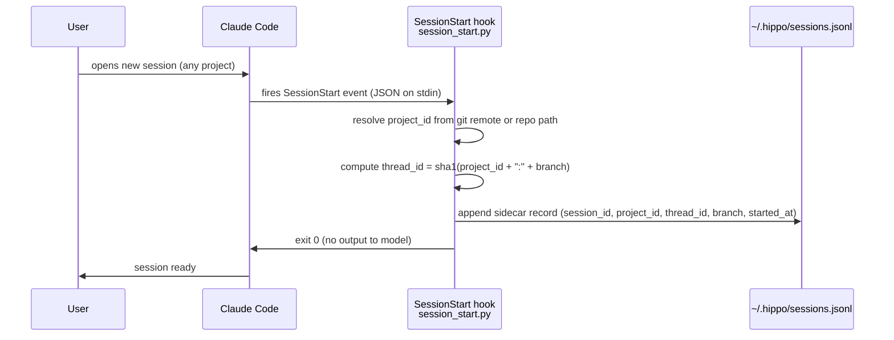
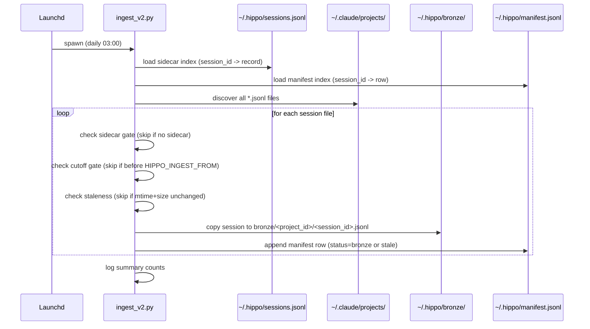
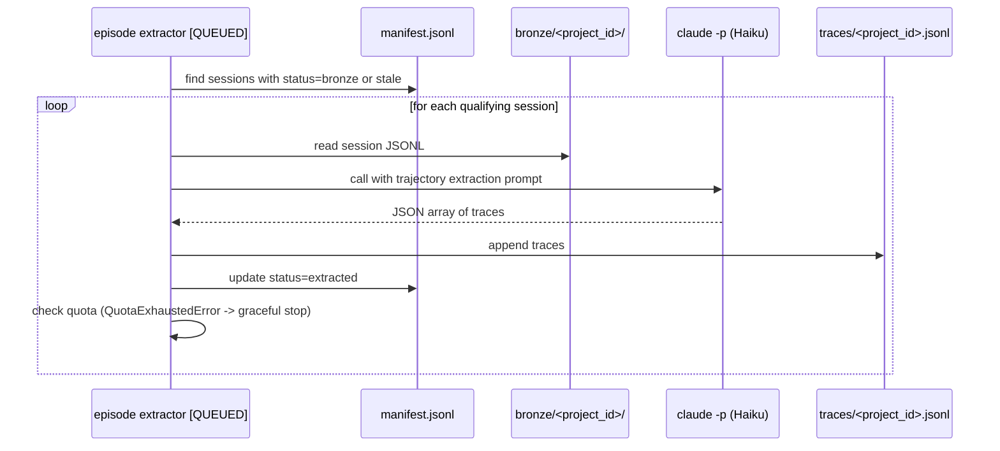
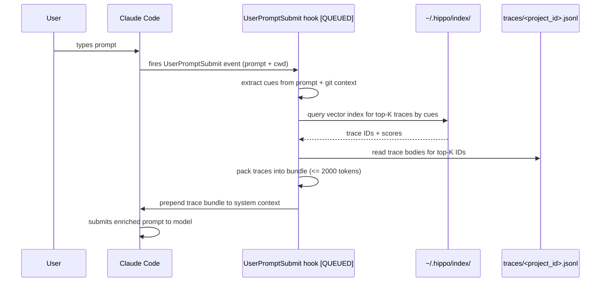

# Section 6: Runtime View

## Scenario 1: Session Start (Capture)

Fires on every new Claude Code session.

Key invariant: the hook writes nothing to the session JSONL and produces no model output.
If `session_id` is absent from the event, the hook logs and exits cleanly without writing.

---

## Scenario 2: Nightly Ingest Run

Fires daily at 03:00 via launchd.

---

## Scenario 3: Episode Extraction [QUEUED]

Planned nightly run after ingest, reads bronze sessions and emits traces.

---

## Scenario 4: Recall Injection [QUEUED]

Fires before each user prompt is submitted to the model.

Key invariant: if the index is absent or the query fails, the hook exits cleanly with no
injection. Recall failure must never block prompt submission.
