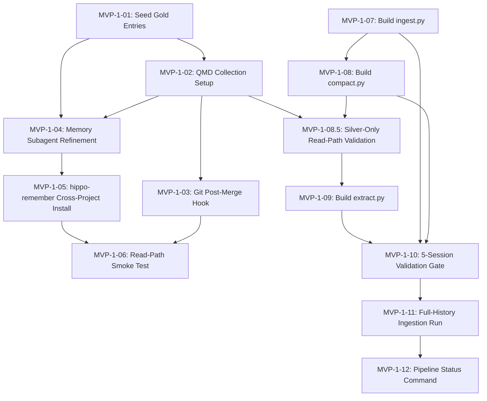

# MVP-1: Epic Design

## 1. Overview

This epic delivers the full Hippo loop end-to-end: raw Claude Code session files flow through
bronze, silver, and gold layers via three Python scripts, producing searchable knowledge entries
that any agent in any project can retrieve via the `/hippo:remember` skill and memory subagent.

The read path (QMD, memory subagent, hippo-remember skill) is seeded and validated first, in
parallel with the write path scripts, so read-path testing does not block on pipeline completion.
The write path (ingest, compact, extract) is built and validated on 5 hand-selected sessions
before being unleashed on full history.

The epic is done when a real query from a non-Hippo project returns a grounded answer sourced
from a session processed by the pipeline, not a hand-crafted seed.

## 2. Dependency Graph



Note: S10 is a hard sequential gate. S11 is blocked until a human reviews the 5-session
validation output. This gate is intentional and cannot be parallelized.

## 3. Wave Breakdown

This epic uses 5 waves. Three unavoidable human validation gates drive the structure: S6
(cross-project read-path smoke test), S8.5 (silver-only quality gate), and S10 (five-session
write-path validation). All three require human judgment on real output before downstream stories
can proceed. No wave restructuring or story collapse removes this constraint.

| Wave | Stories | Rationale |
|------|---------|-----------|
| Wave 1 | MVP-1-01, MVP-1-07 | No intra-epic dependencies. Read-path seeding and write-path ingestion start in parallel. |
| Wave 2 | MVP-1-02, MVP-1-08 | MVP-1-02 needs MVP-1-01 (gold entries to index). MVP-1-08 needs MVP-1-07 (bronze files to compact). Both can run in parallel. |
| Wave 3a | MVP-1-03, MVP-1-04, MVP-1-08.5 | MVP-1-03 needs MVP-1-02. MVP-1-04 needs MVP-1-01 + MVP-1-02. MVP-1-08.5 needs MVP-1-08 + MVP-1-04 + MVP-1-02. MVP-1-03 and MVP-1-04 can run in parallel; MVP-1-08.5 starts after MVP-1-08 (Wave 2) and MVP-1-04 complete. |
| Wave 3b | MVP-1-05, MVP-1-06, MVP-1-09 | MVP-1-05 needs MVP-1-04. MVP-1-06 needs MVP-1-03 + MVP-1-05 (human gate). MVP-1-09 needs MVP-1-08.5 (go/no-go gate) + MVP-1-02. MVP-1-05/MVP-1-06 (read path) and MVP-1-09 (write path) can run in parallel within this wave. |
| Wave 3c | MVP-1-10, MVP-1-11, MVP-1-12 | Sequential tail. MVP-1-10 needs MVP-1-07, MVP-1-08, MVP-1-09 (human gate). MVP-1-11 needs MVP-1-10. MVP-1-12 needs MVP-1-11. |
| Wave 4 | MVP-1-14, MVP-1-15 | Added 2026-04-18 after scope adjustment. Metadata enrichment (MVP-1-14) and subagent ingestion (MVP-1-15) can run in parallel: different code paths (manifest field additions vs. subagent discovery), minor overlap only in `manifest.py` schema comment and `_silver_frontmatter()`. After both complete, MVP-1-11 (scoped validation) is re-run on kenznote-payments to exercise the enriched data shape end-to-end. |

**Effective parallelism:**
- Wave 1: MVP-1-01 || MVP-1-07
- Wave 2: MVP-1-02 || MVP-1-08
- Wave 3a: MVP-1-03 || MVP-1-04 || (MVP-1-08.5 after MVP-1-08 done)
- Wave 3b: (MVP-1-05 -> MVP-1-06) || MVP-1-09 — both must complete before Wave 3c
- Wave 3c: MVP-1-10 -> MVP-1-11 -> MVP-1-12
- Wave 4 (added 2026-04-18): MVP-1-14 || MVP-1-15 — both must complete before re-running MVP-1-11 (scoped validation)

## 4. Infrastructure Stubs

The following directories and files must exist before development begins. These stubs carry
correct imports and empty implementations so developers in Wave 1 can work without merge
conflicts.

### Directories to Create

| Directory | Purpose |
|-----------|---------|
| `scripts/` | All three pipeline scripts live here |
| `bronze/` | Immutable raw session copies (gitignored) |
| `silver/` | Compacted session summaries (gitignored) |
| `docs/playbooks/` | Compact and extract prompt playbooks (S8, S9 reference these) |

### Files to Create as Stubs

| File | Purpose |
|------|---------|
| `scripts/__init__.py` | Makes scripts/ a Python package for shared imports |
| `scripts/manifest.py` | Shared manifest read/write helpers used by all three scripts |
| `scripts/ingest.py` | Entry point for MVP-1-07. Stub with argparse skeleton and empty `main()`. |
| `scripts/compact.py` | Entry point for MVP-1-08. Stub with argparse skeleton and empty `main()`. |
| `scripts/extract.py` | Entry point for MVP-1-09. Stub with argparse skeleton and empty `main()`. |
| `scripts/status.sh` | Entry point for MVP-1-12. Stub with comment block describing expected output. |
| `.gitignore` (append) | Add `bronze/`, `silver/`, `.qmd/` to gitignore if not present |
| `docs/playbooks/compact.md` | Compaction prompt template for compact.py. Referenced by MVP-1-08 AC. |
| `docs/playbooks/extract.md` | Extraction prompt template for extract.py. Referenced by MVP-1-09 AC. |

### Shared Interface: `scripts/manifest.py`

This module is the only cross-story shared interface in the write path. All three pipeline
scripts read and write `manifest.jsonl`. To avoid merge conflicts, the manifest helper is
created in the infrastructure phase:

- `read_manifest(path) -> list[dict]` -- reads all lines, returns parsed entries
- `append_manifest(path, entry: dict)` -- appends a single entry (atomic append)
- `update_manifest(path, session_id: str, updates: dict)` -- updates fields on an existing entry
- `find_entry(manifest: list, session_id: str) -> dict | None` -- lookup by session_id

No business logic. No validation. Just JSON I/O helpers.

### Frozen Manifest Schema

The manifest schema is frozen in the infrastructure phase before S7 and S8 begin. S7 and S8
are built in parallel in Wave 2 and both write to `manifest.jsonl`. Any schema drift between
them causes silent data corruption. The canonical schema below is the authoritative source.
See also arc42 §Manifest Format.

Every entry in `manifest.jsonl` is a JSON object with these fields:

| Field | Type | Set by | Notes |
|-------|------|--------|-------|
| `session_id` | string | MVP-1-07 (ingest) | Unique key. Derived from source JSONL filename. |
| `source_path` | string | MVP-1-07 (ingest) | Absolute path to the original JSONL in `~/.claude/projects/`. |
| `bronze_path` | string | MVP-1-07 (ingest) | Absolute path to the copy in `bronze/`. |
| `silver_path` | string | MVP-1-08 (compact) | Absolute path to the compacted file in `silver/`. Null until MVP-1-08. |
| `gold_paths` | list[string] | MVP-1-09 (extract) | Absolute paths to extracted gold entries. Empty list until MVP-1-09. |
| `status` | string | all scripts | Status progression: see below. |
| `ingested_at` | string (ISO8601) | MVP-1-07 (ingest) | Timestamp when bronze copy was written. |
| `compacted_at` | string (ISO8601) | MVP-1-08 (compact) | Timestamp when silver file was written. Null until MVP-1-08. |
| `extracted_at` | string (ISO8601) | MVP-1-09 (extract) | Timestamp when gold entries were written. Null until MVP-1-09. |
| `bronze_size_bytes` | int | MVP-1-07 (ingest) | Size of the bronze copy in bytes. Canonical name: `bronze_size_bytes`, NOT `session_size_bytes`. |
| `silver_size_bytes` | int | MVP-1-08 (compact) | Size of the compacted silver file in bytes. Null until MVP-1-08. |
| `error` | string | any script | Last error message if status is `failed`. Null otherwise. |
| `harness` | string | MVP-1-07 (ingest) | Source harness, e.g. `"claude-code"`. |
| `project_hash` | string | MVP-1-07 (ingest) | The `~/.claude/projects/` directory name for the session, e.g. `"-Users-mu-src-transgate-frontend"`. |
| `agent` | string or null | MVP-1-07 (ingest) | Agent type from session metadata (`developer`, `tester`, etc.). Null if not a subagent session. |
| `parent_session` | string or null | MVP-1-07 (ingest) | UUID of parent session if this is a subagent session. Null otherwise. |
| `short` | bool | MVP-1-07 (ingest) | True if `bronze_size_bytes` is under the small-session threshold. Short sessions skip compaction. |
| `memory_query` | bool | MVP-1-07 (ingest) | True if the session is a memory-subagent query session. Tagged separately; not compacted. |

**Status progression:**

```
bronze -> silver -> gold
```

Additional terminal statuses:
- `skipped-large`: set by MVP-1-07 if `bronze_size_bytes` exceeds the large-session threshold. No further processing.
- `failed`: set by any script on unrecoverable error. `error` field populated.

The `scripts/manifest.py` stub must include this schema as a comment block before any story
writes code against it.

### Existing Files Confirmed Present (no stubs needed)

| File | Status |
|------|--------|
| `gold/sample-gold-entry-format.md` | Present. Canonical frontmatter template for MVP-1-01. |
| `.claude/agents/memory.md` | Present. To be reviewed and updated in MVP-1-04. |
| `.claude/skills/hippo-remember/SKILL.md` | Present. To be verified and tested in MVP-1-05. |
| `manifest.jsonl` | Present (empty). Ready for MVP-1-07. |
| `feedback.jsonl` | Present (empty). Out of scope for MVP. |

## 5. Per-Story Notes

### MVP-1-01: Seed Gold Entries (Wave 1)

- ACs in scope: All 5 ACs as written.
- File stubs to flesh out: Write directly into `gold/entries/*.md`. Follow the canonical template
  at `gold/sample-gold-entry-format.md`. Do not create new directories.
- Boundaries: Do NOT modify `.claude/agents/memory.md` or the QMD config. Those are MVP-1-04 and MVP-1-02.
- Architectural note: At least one entry should exercise the `gotcha` type with a near-miss
  failure, as this is the key value proposition cited in the technical notes. Suggested topics:
  CDP port, Railway PORT env, Supabase RLS for file uploads.

### MVP-1-02: QMD Collection Setup and Indexing (Wave 2)

- ACs in scope: All 5 ACs as written.
- File stubs to flesh out: No new files. This is configuration and documentation work.
  Update `docs/developer-guide/README.md` to confirm QMD as a prerequisite (already present).
  Confirm `.gitignore` excludes the QMD index directory (`.qmd/`).
- Boundaries: Do NOT create or modify gold entries. Do NOT touch `scripts/`.
- Architectural note: The `--mask "**/*.md"` flag is critical. Without it, QMD indexes all files
  including `sample-gold-entry-format.md`. Verify the mask filters correctly by checking
  `qmd status` count matches the intended entry count only.

### MVP-1-03: Git Post-Merge Hook (Wave 3)

- ACs in scope: All 4 ACs as written.
- File stubs to flesh out: `.git/hooks/post-merge` (executable). Note: `.git/` is not
  tracked in git, so this hook must be documented for setup on new machines (MVP-1-03 AC explicitly
  requires developer-guide documentation).
- Boundaries: Do NOT modify `scripts/`. Do NOT add hook setup to any automated script.
  The hook is intentionally manual-setup only (single-developer system).
- Architectural note: The hook runs `qmd update && qmd embed`. This is the same command
  `extract.py` runs at the end of each extraction (MVP-1-09). Both paths must be in sync.

### MVP-1-04: Memory Subagent Refinement (Wave 3)

- ACs in scope: All 4 ACs as written.
- File stubs to flesh out: `.claude/agents/memory.md` (exists, needs review and possible update).
  Confirm: model is `haiku`, qmd command uses `--collection hippo --json -n 5`,
  response format fields are correct (Answer, Confidence, Last validated, Stale warning).
- Boundaries: Do NOT modify `hippo-remember` skill (that is MVP-1-05). Do NOT modify gold entries.
- Architectural note: The subagent uses `haiku` for latency. The pipeline scripts use
  `sonnet-4-5` for quality. This split is intentional per the epic technical notes.
  Do not change the subagent model to sonnet.
- Sub-task (HIPPO_HOME env var): The memory subagent and the `hippo-remember` skill both
  reference the Hippo project directory. Before MVP-1-05 installs the skill cross-project, update
  `.claude/agents/memory.md` so the working directory is resolved from the `HIPPO_HOME`
  environment variable, defaulting to `~/src/hippo` if unset. The value must be expanded at
  invocation time, not hardcoded as a literal string. This allows the skill to work on any
  machine without editing the skill file after installation.

### MVP-1-05: hippo-remember Skill Cross-Project Install (Wave 3 sequential tail)

- Depends on: MVP-1-04 complete.
- ACs in scope: All 4 ACs as written.
- File stubs to flesh out: `.claude/skills/hippo-remember/SKILL.md` (exists, needs verification
  only). The symlink at `~/.claude/skills/hippo-remember` is created once manually.
- Boundaries: Do NOT modify the memory subagent. Do NOT create new skills.
- Architectural note: The skill delegates via `claude -p --working-directory ~/src/hippo`. This
  means the Hippo project path is hardcoded in the skill. If the project moves, the skill breaks.
  This is an accepted tradeoff for a single-developer system (per ADR-001).

### MVP-1-06: Read-Path Smoke Test (Wave 3 sequential tail)

- Depends on: MVP-1-03 and MVP-1-05 complete.
- ACs in scope: All 6 ACs as written. This is a manual validation story.
- File stubs to flesh out: None. This is a manual test run.
- Boundaries: Do NOT create gold entries during this story. Do NOT modify the skill or subagent.
  If bugs are found, open a fix story rather than patching inline.
- Architectural note: The latency AC (under 30 seconds) is validated here for the first time.
  The `claude -p` subagent spawn adds cold-start overhead. If latency exceeds 30s consistently,
  document it and flag as a post-MVP optimization rather than blocking the epic.

### MVP-1-07: Build ingest.py (Wave 1)

- ACs in scope: All 8 ACs as written.
- File stubs to flesh out: `scripts/ingest.py` (from stub), `scripts/manifest.py` (shared helper).
- Boundaries: Do NOT implement compaction or extraction logic. `scripts/ingest.py` only reads
  `~/.claude/projects/` and writes to `bronze/` and `manifest.jsonl`.
- Architectural note: The manifest helper (`scripts/manifest.py`) is a shared infrastructure
  stub. MVP-1-07 is the first story to flesh it out. Coordinate with MVP-1-08/MVP-1-09 developers if working
  in parallel: MVP-1-07 defines the manifest schema (the field list in the epic technical notes is
  canonical), and MVP-1-08/MVP-1-09 must use it unchanged.

### MVP-1-08: Build compact.py (Wave 2)

- Depends on: MVP-1-07 complete.
- ACs in scope: All 7 ACs as written.
- File stubs to flesh out: `scripts/compact.py` (from stub), `docs/playbooks/compact.md`
  (the compaction prompt template).
- Boundaries: Do NOT modify `scripts/ingest.py` or `scripts/manifest.py` signatures.
  The compact prompt in `docs/playbooks/compact.md` must explicitly instruct the model to
  preserve near-miss failures (MemRL finding cited in technical notes).
- Architectural note: The `--no-mcp` flag on `claude -p` calls is required. Without it,
  Claude loads all MCP servers, adding latency and risking side effects during bulk processing.

### MVP-1-08.5: Silver-Only Read-Path Validation (Wave 3a/3b gate)

- Depends on: MVP-1-08 complete, MVP-1-04 complete, MVP-1-02 complete.
- Scope: Register `silver/` as a QMD collection named `hippo-silver`. Run the same 5-question validation set planned for MVP-1-10, but query `hippo-silver` instead of `hippo`. Compare answer quality against the hand-crafted gold baseline from MVP-1-06. Human decides go/no-go on MVP-1-09.
- Out of scope: No extract.py work, no gold entries created, no reconcile, no changes to the `hippo` collection.
- Gate criterion: If silver answers are within approximately 70% of expected quality (concrete details present, near-miss failures surfaced, no hallucination on no-match queries), proceed to MVP-1-09. If silver answers are garbage (vague, missing specifics, or the collection is empty), stop and fix compact.py before proceeding. This decouples compact-quality failures from extract-quality failures.
- File stubs: None. This is a manual run + judgment call.
- Architectural note: The `hippo-silver` collection is temporary scaffolding. It does not need to be maintained post-MVP. Deregister or leave in place; it does not affect the `hippo` gold collection.

### MVP-1-09: Build extract.py (Wave 3b)

- Depends on: MVP-1-08.5 go/no-go gate passed, MVP-1-02 complete.
- ACs in scope: All 9 ACs as written.
- File stubs to flesh out: `scripts/extract.py` (from stub), `docs/playbooks/extract.md`
  (the extraction prompt template).
- Boundaries: Do NOT modify `scripts/compact.py`. The duplicate detection threshold (0.85)
  is specified in the ACs and must not be changed without a separate decision.
- Architectural note: MVP-1-09 calls `qmd update && qmd embed` after writing all entries for a run.
  This same operation is performed by the git post-merge hook (MVP-1-03). Both paths must use the
  same QMD collection name (`hippo`) and the same mask. Extract.py must not call `qmd embed`
  per-entry (would be slow and redundant) but once at the end of the run.

### MVP-1-10: 5-Session Validation Gate (Wave 3 sequential tail)

- Depends on: MVP-1-07, MVP-1-08, MVP-1-09 complete.
- ACs in scope: All 8 ACs as written. This is a manual review + iteration story.
- File stubs to flesh out: None. The story may produce prompt changes in `docs/playbooks/compact.md`
  and/or `docs/playbooks/extract.md` if quality issues are found.
- Boundaries: Do NOT ingest the full history. Do NOT modify pipeline script logic; only the
  prompts in the playbook files should change.
- Architectural note: This is the quality gate for the MemRL hypothesis: near-miss failures
  must survive compaction. If the compact prompt loses them, iteration happens here on the
  prompt only. If the issue is structural (e.g., the silver format loses context), flag to human
  as it may require script changes outside this story's scope.

### MVP-1-11: Full-History Ingestion Run (Wave 3 sequential tail)

- Depends on: MVP-1-10 complete (hard gate).
- ACs in scope: All 7 ACs as written. Mostly a run-and-wait story.
- File stubs to flesh out: None. This story produces gold entries and manifest entries, not code.
- Boundaries: Do NOT modify any scripts during this run. If errors occur, log them and continue
  (per the epic technical notes: scripts log per-session failures and continue).
- Architectural note: The `skipped-large` manifest status is the only new status introduced
  beyond bronze, silver, gold. `manifest.py` must support this status before MVP-1-11 runs.
  Confirm `scripts/manifest.py` is updated by MVP-1-08 if needed (MVP-1-08 is where large session detection
  is implemented).

### MVP-1-12: Minimal Pipeline Status Command (Wave 3 sequential tail)

- Depends on: MVP-1-11 complete.
- ACs in scope: All 3 ACs as written.
- File stubs to flesh out: `scripts/status.sh` (from stub).
- Boundaries: Do NOT implement staleness, suggestions, or promotion detection. Those are
  explicitly post-MVP per the epic out-of-scope section.
- Architectural note: The three commands in the ACs (`jq`, `ls | wc -l`, `qmd status`) are
  all idempotent read operations. `scripts/status.sh` is a convenience wrapper only, not a
  new pipeline stage.

## 5.5 Scope Adjustment (2026-04-18) — Scoped Validation + Metadata Enrichment

After the initial Wave 1–3 implementation was complete, a scope adjustment was made to
unblock real-world validation without burning the weekly Claude Max quota on full-history
processing, and to preserve additional provenance metadata that every session's JSONL
already carries. The adjustment adds two new stories (MVP-1-14 and MVP-1-15), narrows
MVP-1-11 from "full history" to "one active project", and rolls the remaining work into
four explicit phases below. No existing story is reopened; the completed work is
preserved as-is.

### Phase A — Session metadata enrichment (MVP-1-14)

Every JSONL record in `~/.claude/projects/<project>/<session>.jsonl` already carries
three fields we have been ignoring:

- `cwd` — the exact working directory (disambiguates ambiguous project-hash encodings)
- `gitBranch` — the active git branch at the time each record was written
- `timestamp` — ISO8601 per record

During ingest, we read the first ~20 records of each JSONL and capture:

- `cwd` → first seen
- `git_branch` → first seen (branch changes mid-session are tolerated but not tracked;
  most sessions stay on one branch)
- `session_started_at` → ISO8601 from the first record that has `timestamp`

These three fields are added to the manifest schema and propagated through silver
frontmatter into gold. Old entries remain with null values; no backfill.

Rationale: these are "free" signals (authoritative, structured, already in the file)
that unlock branch-tagged and time-ordered queries. Parsing `project_hash` was an
earlier idea that is now unnecessary because `cwd` is exact.

### Phase B — Subagent session ingestion (MVP-1-15)

Each session directory contains a `subagents/` subdirectory:

```
<project>/<parent-session-uuid>/subagents/
├── agent-<aid>.meta.json   # {"agentType": "tech-lead", "description": "<task>"}
└── agent-<aid>.jsonl       # full subagent transcript (isSidechain:true, agentId)
```

Across the user's Claude Code history: ~417 subagent sessions (developer 112, Explore
91, tester 59, tech-lead 51, architect 32, general-purpose 31, product-manager 19,
react-ui-designer 8, Plan 7, others). All are silently skipped today because ingest.py
only scans top-level `*.jsonl` files.

Model: each subagent becomes its own manifest entry with its own `session_id` (derived
from `agent-<aid>`), `agent` (from `agentType`), `agent_task` (new field, from
`description`), and `parent_session` set to the outer session UUID. Subagents are NOT
collapsed into their parent's silver — they carry separate intent and produce separate
gold that agent-scoped views can filter.

### Phase C — Tool-results sidecars (deferred — out of MVP scope)

Each session directory also contains a `tool-results/` subdirectory with two kinds of
`.txt` files:

- `hook-<toolUseID>-<N>-additionalContext.txt`: overflow from hook stdout (in the user's
  case, claude-mem observer dumps). These reflect another tool's worldview — ingesting
  them would bias Hippo's learning.
- `<random8>.txt` (e.g. `b45sbhqti.txt`): overflow from tool-call outputs (Bash, Read,
  Grep) that exceeded the inline JSONL preview threshold (~2 KB). The JSONL always
  carries the preview; only the tail of very large outputs is in the sidecar.

For MVP, the JSONL's inline 2KB preview is sufficient. Full sidecar ingestion is
deferred to Post-MVP. If silver quality in Phase D shows systematic loss of tool-call
tails, reconsider.

### Phase D — Scoped validation on one active project (MVP-1-11, re-scoped)

Validate the pipeline on the sessions of `/Users/mu/Business/Kenznote/kenz-note/payments`
(project_hash `-Users-mu-Business-Kenznote-kenz-note-payments`, ~7 top-level sessions
plus their subagent transcripts). This exercises the full Phase A + B data shape against
a small, currently-active workload where the user can immediately feel retrieval value.

Full-history ingestion (the original MVP-1-11 scope) is deferred to Post-MVP. The "at
least 10 gold entries" original AC becomes "at least 3 from kenznote-payments" given
the narrower scope; the epic still requires a cross-project read-path hit (MVP-1-06-style).

### Updated manifest schema fields

| Field | Type | Set by | Added in | Notes |
|-------|------|--------|----------|-------|
| `cwd` | string | ingest | Phase A | Exact working directory from JSONL records. |
| `git_branch` | string or null | ingest | Phase A | First seen; may be null if session pre-dated gitBranch recording. |
| `session_started_at` | string (ISO8601) | ingest | Phase A | First record timestamp. Distinct from `ingested_at`. |
| `agent_task` | string or null | ingest | Phase B | Subagent `description` from `agent-<aid>.meta.json`. Null for top-level sessions. |

All four fields are nullable. Existing manifest entries are not backfilled.

## 6. Risks

### R1: QMD 2GB model download blocks Wave 3a start

The `qmd embed` step downloads a local GGUF embedding model (~2GB) on first use. If this
download has not happened before Wave 3a begins, MVP-1-09 (`extract.py`) will stall at the embed
call with no useful error.

**Mitigation:** MVP-1-02 must run `qmd embed` as part of its acceptance criteria and must have a
completion gate confirming the model is present locally before MVP-1-02 is marked done. Wave 3a
(including MVP-1-09) is blocked on MVP-1-02 completion. This gate is explicit in the wave dependency graph.

### R2: Manifest schema drift between MVP-1-07 and MVP-1-08 (parallel Wave 1/2)

MVP-1-07 and MVP-1-08 both write to `manifest.jsonl` and are built in parallel across Waves 1 and 2.
If they operate against different field assumptions, entries will be silently incomplete.

**Mitigation:** The manifest schema is frozen in the infrastructure phase (see Section 4,
Frozen Manifest Schema) before any story writes code. The `scripts/manifest.py` stub includes
the full field list as a comment block. Developers must not add fields without updating the
canonical schema in this document first.

### R4: MVP-1-08.5 reduces risk that retrieval + subagent quality is invisible until late

Without MVP-1-08.5, the first read-path signal from pipeline-produced content arrives at MVP-1-10, after all three write-path scripts are built. A fundamental compact-quality failure (silver too vague, near-misses lost) would only surface then. MVP-1-08.5 moves this signal to after MVP-1-08, before extract.py is written. If silver answers score well, MVP-1-09 builds on a validated foundation. If they score poorly, the failure is contained to compact.py prompt iteration rather than requiring rework across both compact.py and extract.py.

### R3: hippo-remember skill hardcodes ~/src/hippo path

The skill delegates via `claude -p --working-directory ~/src/hippo`. If the project moves or
is installed on a different machine, all installations break silently.

**Mitigation:** MVP-1-04 includes a sub-task to resolve the path from `HIPPO_HOME` env var with
default `~/src/hippo`. The skill's `SKILL.md` must document this env var as a required
configuration step for new installations.
