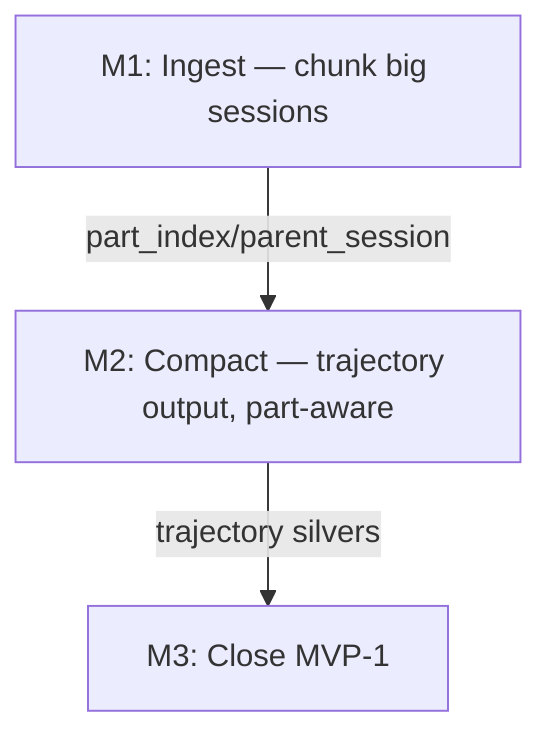

# MVP-1 Closeout — Hackathon Brief

**Hypothesis:** Hippo's pipeline can produce useful gold from real (large, messy) Claude Code sessions if we (a) stop discarding the most valuable inputs and (b) reshape silver from gold-style themed facts to RL-style chronological trajectories.

**Timeline:** ~5–6 hours
**Mode:** Pair programming with Claude

## Context

Carrying state from the 2026-04-25 session — see [`docs/product/epics/MVP-1/README.md` § Session Wrap-Up](docs/product/epics/MVP-1/README.md). Concretely:

- MVP-1-14 and MVP-1-15 are in `review`, MVP-1-11 partially run (7/10 silvers compacted, 1 failed, no extract), MVP-1-12 partially done (script ships, docs not stripped).
- Compact run on `kenznote-payments` exposed two paired ingest defects: sessions >300 KB compact-fail (echo mode) and sessions >500 KB skip ingest entirely. Both = no chunking.
- Silver output is wrong shape: thematic sections (Decisions / Problems / Configs / Near-Misses) are gold-shape, not silver-shape. The brainstorm framing wants RL-style trajectory: action → env feedback → correction, chronological.
- `docs/playbooks/{compact,extract}.md` are misused as model prompts. Playbooks are a claude-team `/playbook` concept, not a prompt store. Their human-facing scaffolding bleeds into silver as narration noise.

## Research Foundations (must read before coding)

These three papers, surveyed in [`docs/brainstorm/related-work.md`](docs/brainstorm/related-work.md) and synthesized in [`docs/brainstorm/session-summary.md`](docs/brainstorm/session-summary.md), drive the design. Implementation choices that contradict them are wrong by construction.

### 1. RL framing — sessions as implicit RL episodes

Source: [`docs/brainstorm/session-summary.md`](docs/brainstorm/session-summary.md) § Core Insight.

> AI coding sessions are already implicit RL episodes. The agent acts, the environment responds (code runs, tests pass/fail, errors appear), and outcomes are observable. The problem is that this experience is lost when the session ends.

In RL terms a Hippo session is a sequence of `(s_t, a_t, r_t, s_{t+1})` tuples:

- `s_t` — state: codebase + session context at step t
- `a_t` — action: tool call, edit, message produced by the agent
- `r_t` — **reward signal: environment's response** — tool error, test failure, user correction, compile error, "no, that's wrong"
- `s_{t+1}` — updated state

**Implementation consequence:** silver must preserve the `(a, r, adjustment)` chain *in time order*. The reward signal `r_t` is the most teaching-rich part — tool errors, "that's wrong, try X", failed assertions. Compact must keep these woven into the narrative at their point of occurrence, not extracted into a separate "problems" section.

Closely related: [**AgentRR** (May 2025)](https://arxiv.org/) — record-and-replay paradigm for AI agent frameworks. Validates the "sessions as replayable knowledge" framing.

### 2. **MemRL** (Jan 2026) — near-miss failures > clean successes

Source: [`docs/brainstorm/related-work.md`](docs/brainstorm/related-work.md) § Experiential Learning Without Weight Updates.

> Self-evolving agents via RL on episodic memory. Found that near-miss failures are more valuable than clean successes. A critic model assigns higher value to memories that provide reusable guidance, including corrective heuristics from almost-successes.

**Implementation consequence:** the compact prompt must privilege near-miss failures — but **inline at their point of occurrence in the trajectory**, not in a separate "Near-Misses and Gotchas" section as the current playbook does. A near-miss ripped from its `(a, r, adjustment)` context loses its teaching value. The trajectory must show: agent did X, env said "you almost got it but Y", agent switched to Z. That whole sequence is the unit of learning — not just "Y was the gotcha."

### 3. **Not Always Faithful Self-Evolvers** (Jan 2026) — agents follow raw experience, not abstract summaries

Source: [`docs/brainstorm/related-work.md`](docs/brainstorm/related-work.md) § Experiential Learning Without Weight Updates.

> Agents are more faithful to raw experiences than condensed insights. When given both raw trajectory and abstract heuristic, agents follow the raw. Implication: gold entries need concrete commands, ports, file paths, not just abstract principles.

**Implementation consequence:** silver must keep concrete values inline (paths, error messages, command flags, port numbers, file:line refs). The current playbook has a "Configuration Details" section that aggregates these — strip them out of context. Trajectory shape keeps them where they happened.

### 4. **ERL** (ICLR 2026 MemAgents Workshop) — heuristics from experience transfer better

Source: [`docs/brainstorm/related-work.md`](docs/brainstorm/related-work.md) § Experiential Learning Without Weight Updates.

> Generates reusable heuristics from single-attempt trajectories. Key findings for Hippo: (1) heuristics transfer better than raw trajectories, (2) LLM-based retrieval outperforms embedding-only, (3) heuristics need concrete detail to be effective.

**Implementation consequence:** validates the medallion split: silver preserves the raw-ish trajectory (single-attempt experience); gold extracts reusable heuristics from it. We've been collapsing both stages into one — silver was already producing heuristics-shape output, leaving extract nothing distinct to do. M2 corrects this.

### 5. **"Does RL Really Incentivize Reasoning?"** (NeurIPS 2025 Oral) — why this whole project exists

Source: [`docs/brainstorm/related-work.md`](docs/brainstorm/related-work.md) § Reinforcement Learning for LLM Reasoning.

> Key finding: RLVR doesn't create new reasoning patterns. It sharpens existing distributions. Base models at high pass@k outperform RL-trained models. RL is a "distribution sharpener," not a capability expander.

**Implementation consequence:** this validates the entire approach of improving external knowledge instead of model weights. Frames Hippo as the practical answer to "if we can't update weights, how do we make agents learn from experience?"

### Medallion architecture, restated under these foundations

| Layer | Shape | Research backing |
|---|---|---|
| **Bronze** | raw JSONL trajectory, immutable | Not Always Faithful (preserve raw) |
| **Silver** | denoised chronological trajectory: `(a, r, adjustment)` events in time order | RL framing + MemRL (near-misses inline) |
| **Gold** | reusable heuristics with frontmatter | ERL (heuristics transfer better) |

Today bronze is right. Silver is wrong-shape (gold-shape leaking down). Gold is right-shape but starves on already-distilled silver input. M2 fixes this.

## Success Criteria

- [ ] No `kenznote-payments` session is `skipped-large` after re-ingest (chunking covers up to 10 MB).
- [ ] Silver files read as chronological trajectories — action → env feedback → correction events, not themed fact lists.
- [ ] Compact does not echo-fail on big sessions (specifically the 4.2 MB `550caba1-…`, which now compacts as multiple parts).
- [ ] Extract produces ≥3 gold entries from the trajectory silvers, with concrete details (paths, errors, file:line refs).
- [ ] Cross-project test: `/hippo-remember` from a non-Hippo project returns a grounded answer sourced from an auto-extracted entry.
- [ ] `docs/playbooks/` no longer contains prompt files (compact/extract). Reconcile and status playbook stubs cleaned up. MVP-1-12 doc cleanup done.
- [ ] MVP-1-11/12/14/15 signed off; epic README progress reflects state.

## Hackathon Process

- Never commit or mark spikes as without user feedback
- unit tests are never enough to validate spikes
- You must run the actual command and validate the output

## Solution & Milestones

The two pipeline defects (>300 KB echo / >500 KB skip) collapse to one fix: chunking at ingest time. The trajectory prompt rewrite is decoupled from chunking but only pays off once chunks exist (a `part K of N` prompt without parts is wasted iteration). M3 is integration glue.

### M1 — Ingest: chunk big sessions, stop skipping

**Why:** Without chunking, the 4 of 5 largest `kenznote-payments` sessions are dropped at ingest. **Not Always Faithful** says concrete details from real experience matter most — those are exactly what the largest sessions contain. **MemRL** says near-misses are most valuable — long debugging sessions are where near-misses live. We're discarding the highest-value data.

**Risk:** Boundary choice (user-turn alignment) misjudges where causal coherence lives in real Claude sessions; chunks come out semantically incoherent across boundaries, breaking the `(a, r, adjustment)` chain that M2 relies on.

**Demo:** `manifest.jsonl` shows the 4.2 MB `550caba1-…` as ~17 coherent parts. Nothing in `skipped-large` that we don't *want* skipped. Bronze contains all the parts as separate JSONL files.

**Spikes:**
- [x] S1.1 (5min) — Decide split boundary. **Decision: user-turn-aligned** (cut at user-message boundaries; soft target ~250 KB, hard cap ~350 KB per chunk to leave room for the prompt; if a single user-turn exceeds the hard cap, fall back to byte-aligned within that turn).
  - **Rationale:** in the RL framing, a user message is the cleanest "episode boundary" — it represents a new instruction or a course correction. Cutting there preserves the `(state, action, reward, adjustment)` arc within each chunk. Byte-aligned cuts could land mid-tool-call, severing a tool's `(action, response)` pair which is the core reward signal.
- [x] S1.2 (~2hr) — Implement chunked ingest in [`scripts/ingest.py`](scripts/ingest.py). Sessions over ~250 KB split into parts. New manifest fields: `part_index` (1-based int or null for unsplit), `total_parts` (int or null). `parent_session` points back to original session UUID for parts. Bronze filename: `YYYY-MM-DD_<sid>_part_<NN>.jsonl`. Hard skip only above 10 MB. Document in [`scripts/manifest.py`](scripts/manifest.py) schema comment. Update tests.
  - **Reuse:** existing user-turn detection lives in `extract_session_metadata` (reads first 20 records skipping `permission-mode`); generalize that pattern. Existing chunked-write idiom: `shutil.copy2` is fine for byte-identical, but for chunked we'll iterate JSONL lines and write per-part files.
  - **Schema reference:** [`scripts/manifest.py`](scripts/manifest.py) frozen schema comment block — add fields adjacent to `parent_session` since they share semantics (link back to a logical parent).
- [x] S1.3 (~10min) — Wipe + re-ingest `kenznote-payments`: `> manifest.jsonl && rm -rf bronze/claude-code/* silver/* gold/entries/* && python -m scripts.ingest --source ~/.claude/projects/-Users-mu-Business-Kenznote-kenz-note-payments`.
- [x] S1.4 (~1hr) — Replace greedy splitter with **heuristic-balanced splitter** in `_split_jsonl_user_aligned`. The greedy version has two known weaknesses surfaced in S1.2 validation: (a) tail parts can be tiny (e.g. `agent-a14094_part_03` was 8.7 KB, below `SHORT_SESSION_BYTES_THRESHOLD` → would be skipped by compact); (b) cuts can fall mid-tool-call, severing the `(action, env_response)` pair that compact relies on for the RL trajectory. Heuristic-balanced fixes both globally instead of per-step.
  - **Algorithm:**
    1. `target_parts = ceil(total_size / CHUNK_SOFT_BYTES)`. Ideal cut offset for split k is `total_size * k / target_parts` (uniform).
    2. For each ideal cut k=1..N-1, scan a window (`±50 KB` or `±10%` of part size, whichever larger) for split candidates.
    3. **Score each candidate line offset:**
       - `+10` if the line at this offset is a user-turn boundary (`type=user`, `role=user`)
       - `-5` if cutting here leaves an open tool-call unresolved (a `tool_use` in chunk K whose matching `tool_result` lives in chunk K+1) — track open `tool_use_id`s during the scan
       - `-distance / window_radius` (gentle penalty so closest-to-ideal wins ties)
    4. Pick the highest-scored candidate per ideal position. If best score is still negative (no good user-turn in the window and tool-calls torn), fall back to closest line break that doesn't tear a tool-call.
    5. Cut at the chosen offsets.
  - **Properties:** parts are roughly uniform in size (no tiny tails), user-turn-aligned where possible, tool-call-coherent where possible. The hard-cap fallback path becomes mostly unreachable but is kept as a defensive ceiling.
  - **Tests to add:** (a) tail-part-size minimum (every part ≥ SHORT_SESSION_BYTES_THRESHOLD when feasible); (b) no torn tool-calls across boundaries on the kenznote sessions; (c) part size variance below ~30%.
  - **Validation:** re-run ingest on `kenznote-payments`, verify no part is below the short threshold and no tool_use_id spans a boundary.

**Done when:** Re-ingest verification shows: 0 unwanted `skipped-large`, big sessions present as parts, `part_index`/`total_parts` populated, tests green. After S1.4: parts are size-balanced and tool-call-coherent.

### M2 — Compact: trajectory output, part-aware

**Why:** Current silver collapses the trajectory into themed facts (Decisions / Problems / Configs / Near-Misses) — that is gold-shape, in violation of **ERL** (silver should preserve experience; gold should distill heuristics). Result: silver and gold do similar work, gold starves on already-distilled input. Plus **MemRL** says near-misses lose teaching value when ripped from their `(a, r, adjustment)` context — exactly what the current "Near-Misses and Gotchas" section does.

**Risk:** Trajectory output may turn out worse for extract input than thematic, or the part-aware prompting fails to preserve cross-part causality. Mitigation: A/B against the 7 archived thematic silvers in S2.4.

**Demo:** Open one trajectory silver and one thematic silver (from the previous run, archived in `/tmp`) side-by-side. Trajectory reads as "what happened" in causal order; thematic reads as facts grouped by category. Echo failure (>300 KB → tiny silver of just the closing message) does not recur.

**Spikes:**
- [x] S2.1 (~30min) — Relocate prompts and wire dual-prompt routing. Three pieces:
  - **(a) Move + strip:** [`docs/playbooks/compact.md`](docs/playbooks/compact.md) → `scripts/prompts/compact.md`; [`docs/playbooks/extract.md`](docs/playbooks/extract.md) → `scripts/prompts/extract.md`. Strip Purpose / When to Run / pipeline-orchestration steps / Notes — keep only the actual instruction body addressed to the model.
  - **(b) Placeholder continue prompt:** create `scripts/prompts/compact_continue.md` as a stub. S2.2 fills the content; S2.1 just establishes the file so compact.py routing has somewhere to point.
  - **(c) compact.py routing:** add `DEFAULT_CONTINUE_PROMPT` constant, `--continue-prompt` arg, and per-entry routing logic — if `entry.part_index is not None and entry.part_index > 1`, load the continue prompt instead of the main prompt. The actual prior-silver context-injection logic is S2.2 (with the rest of the multi-part orchestration).
  - **Why this is its own spike:** "playbook" is a [claude-team `/playbook` concept](https://docs.claude.com/) for deterministic agent-callable tasks. Misusing the directory as a prompt store causes (a) human-facing scaffolding (Purpose, Quality Check) to bleed into model output as narration, and (b) confusion for anyone reading the project who expects `/playbook` semantics.
- [x] S2.2 (~1hr, iterative) — Rewrite `scripts/prompts/compact.md` for trajectory shape, grounded in research:
  - **RL framing** (from [`docs/brainstorm/session-summary.md`](docs/brainstorm/session-summary.md) § Core Insight): output a chronological narrative of session events as `(action, environment_response, adjustment)` tuples. Each entry: what was attempted, what the environment returned (tool output, error, test result, user reaction), and how the agent corrected. Time order, not theme order.
  - **MemRL** (near-misses inline): preserve near-miss failures *at their point of occurrence in the trajectory*, not in a separate section. Show the cause-and-effect: "agent tried X → tool said Y → agent realized Z and switched to W." That whole arc is the unit of learning.
  - **Not Always Faithful** (concrete inline): keep paths, error messages, command flags, port numbers, file:line refs at the moment they happened. Do not aggregate them into a "Configuration Details" list.
  - **No thematic sections.** No "Decisions" / "Problems" / "Configurations" / "Near-Misses" / "Open Questions" headings. Those are for gold (extract.py decides what's heuristic-worthy).
  - **Part-aware compaction with shared silver (revised after S1.2 validation):** parts of one logical session share a single silver file (`silver/<base>.md`, no `_part_NN` suffix). Compaction processes parts **in order** — part N is eligible only when part N-1 has `status=silver`. Subagent prompt for part N (the `compact_continue.md` prompt) receives the existing silver content as read-only **prior context** plus bronze part N as input; outputs only the *new* trajectory section, which is **appended verbatim** to the silver file. Prior silver is never re-edited. This preserves the `(a, r, adjustment)` chain across part boundaries (MemRL/RL framing) — the previous "summarize this slice only; do not refer backward" framing was over-cautious and broke causal continuity at boundaries.
  - **No backward-recap clause in the prompt.** Earlier draft proposed a "if the prior silver ends with a pending action, recap it" instruction. Dropped. Conditional prompt clauses are unstable (often ignored), add latency, and we rely instead on **S1.4's tool-call-aware splitter** (forward-pull + scoring keeps `(action, env_response)` pairs co-located in the same part). Boundary-spanning losses are accepted; gold's heuristic-extraction stage compensates by aggregating across the corpus (ERL: heuristics transfer better than raw trajectories).
  - **Tail-chunk handling:** disable the `short` skip for any entry with `part_index != null`. A deliberately-chunked slice is never "too short to be worth it" — it's a continuation of an already-eligible session. (S1.4 also reduces tiny-tail occurrence by size-balancing.)
  - **Idempotency on re-compact:** track `silver_offset_bytes: int | None` per part entry in the manifest — the byte offset in `silver/<base>.md` where this part's contribution starts. On re-compact part N, truncate the silver file to `entries[N].silver_offset_bytes` and re-run forward. **No inline `<!-- part N/M -->` marker** — silver stays clean, manifest is the system of record for pipeline state. Bytes contributed by part N is derivable as `next_part.silver_offset_bytes - this_part.silver_offset_bytes` (or `EOF - offset` for the last part).
  - **Token budget caveat:** prior silver grows linearly with parts. By part 16 of `550caba1`, prior silver could reach ~200–300 KB. Still well under context limits, but if it becomes an issue, fall back to showing only the last few events of prior silver (just enough for boundary continuity).
  - **Schema:** all N part manifest entries point to the same `silver_path`. Add `silver_offset_bytes`. `silver_size_bytes` keeps its existing meaning (total silver file size, set on each part write).
  - **Suppress preamble narration** ("I'll compact this session…"). Direct output of the trajectory only.
  - **Reference structure for the prompt body:** see existing [`docs/playbooks/compact.md`](docs/playbooks/compact.md) for the *current* (wrong-shape) prompt — useful as a contrast. The good content to preserve from it: the explicit "preserve concrete values" instruction, the "remove file dumps" noise list. Discard everything else.
- [x] S2.3 (~15min) — Transient retry in [`scripts/compact.py:call_claude_compact`](scripts/compact.py). Today only 429 retries. Extend: `rc != 0` with empty stderr also retries (with same backoff); >3 retries → `failed`. Reason: in the previous run, `agent-a56f9ab108f2c12ca` failed silently with empty stderr — root cause unclear, but transient retry is the correct general response.
- [x] S2.4 (~30min) — Compact every bronze + part. A/B silvers against existing 7 thematic silvers archived in `/tmp`. Eyeball-judge per ERL criterion: does trajectory output preserve enough raw experience for extract to derive heuristics from it?
  - **Result (partial):** 15/46 entries reached silver in the live run before the Claude API token quota was exhausted. Pattern: first ~22 entries OK, then sustained `rc=1, empty stderr` (same fingerprint S2.3 retries on, but persistent quota-style not transient). 3 logical sessions are fully or partially silvered (`534c2ba9` 3/3, `64cf529a` 5/6, `550caba1` 7/16). The remaining 15 `failed` + 16 deferred entries can be re-processed by resetting `failed→bronze` and re-running compact when quota refreshes. A/B vs archived thematic silvers skipped (archives gone). Trajectory shape validated on the produced silvers and the synthetic-rl-001 fixture: chronological `(action, response, adjustment)` events, near-misses inline, concrete values inline, no thematic sections, no preamble or closing summary. Prompt tightened mid-spike so user-driven changes always start a new step (`**User:**` line) and `**Adjustment:**` is reserved for environment-feedback recoveries — keeps the source of every change unambiguous in silver.

**Done when:** Every bronze entry has a silver. No echo failure on the largest sessions. Trajectory silvers visibly differ from thematic ones (cause-effect chain visible; reward signals — errors, corrections — woven into narrative). Concrete values (paths, errors, ports) appear inline at their point of occurrence.

### M3 — Close MVP-1

**Why:** Validates the full loop end-to-end. **ERL**'s key finding — *LLM-based retrieval outperforms embedding-only* — is what justifies the memory subagent over raw RAG. The cross-project query in S3.3 is the single test that proves the whole architecture works: a real question from elsewhere, answered via gold derived from real session experience.

**Risk:** Extract still produces over-abstract gold, or QMD reindex misses entries, or cross-project query returns nothing useful.

**Demo:** `/hippo-remember "<real kenznote operational question>"` from a non-Hippo project returns a grounded answer sourced from auto-extracted gold (not seeds — there are none, gold/entries was wiped).

**Spikes:**
- [x] S3.1 (~30min) — `python -m scripts.extract` end-to-end on the new trajectory silvers. Inspect resulting gold for concreteness per **Not Always Faithful** (specific paths, errors, commands — not abstract principles). If too abstract, iterate on `scripts/prompts/extract.md`.
  - **Reuse:** existing [`docs/playbooks/extract.md`](docs/playbooks/extract.md) prompt body is mostly correct (heuristic-shape with concrete-detail requirement); just relocate (S2.1) and lightly re-tune for trajectory input.
- [x] S3.2 (~5min) — Recalibrate `RATIO_WARN_LOW` / `RATIO_WARN_HIGH` in [`scripts/compact.py:44-45`](scripts/compact.py). Old thresholds (40%/90%) reflected the wrong target (thematic summaries). Likely new bands: ~1% (echo-failure floor — catches the previous failure mode) and ~25% (insufficient-compression ceiling for trajectory output).
- [x] S3.3 (~15min) — `qmd collection add gold/entries --name hippo --mask "**/*.md" && qmd update && qmd embed`; verify count. Cross-project query from any non-Hippo project: `/hippo-remember <real question>`.
  - **Why this works** (per ERL finding 2): the [memory subagent](.claude/agents/memory.md) uses LLM-based retrieval — qmd does hybrid BM25+vector+rerank, then the subagent synthesizes an answer in its own context. Outperforms cosine-similarity-only RAG.
- [x] S3.4 (~20min) — Cleanup `docs/playbooks/`:
  - delete [`docs/playbooks/ingest.md`](docs/playbooks/ingest.md) (orphan, never read by any script — confirmed via grep)
  - move [`docs/playbooks/reconcile.md`](docs/playbooks/reconcile.md) to `docs/brainstorm/reconcile-design.md` (post-MVP design sketch, not a playbook)
  - [`docs/playbooks/status.md`](docs/playbooks/status.md) — strip P3 staleness/promotion sections to satisfy MVP-1-12 ACs, then either move to `docs/arch42/` or delete entirely if it's just CLI usage
  - net result: `docs/playbooks/` directory either gone or only contains documents that match what claude-team means by "playbook" (deterministic agent-callable tasks).
- [x] S3.5 (~5min) — Update story statuses: MVP-1-14 → done, MVP-1-15 → done, MVP-1-11 → done, MVP-1-12 → done. Update [epic README](docs/product/epics/MVP-1/README.md) progress (16/16) and Session Wrap-Up section to reflect closeout.

**Done when:** All MVP-1 acceptance criteria check; cross-project query returns auto-extracted gold; `docs/playbooks/` no longer misused.

### M4 — Reconcile: keep gold coherent as it grows

**Why:** Extract is per-silver and stateless — it cannot see existing gold. Without a reconcile stage, gold accumulates duplicates, contradictions, and stale entries. **ERL**'s "LLM retrieval > embedding-only" finding only holds if the corpus is coherent; 5 near-duplicate entries poison rerank and dilute the subagent's synthesis. Per **MemRL**, retired-but-superseded entries are also valuable (the *adjustment* part of the trajectory) — so reconcile must preserve history, not delete.

**Out of scope (deferred):**
- Graph-shaped gold / typed inter-entry edges. Captured in [`docs/brainstorm/graph-gold.md`](docs/brainstorm/graph-gold.md). Revisit after M3+M4 ship and we see whether retrieval is actually missing something graph would fix.
- Remote-run reconcile (Cloud Routine). MVP-1 reconcile runs locally where the QMD index lives (Path A). Path forward sketched in [`docs/brainstorm/remote-pipeline.md`](docs/brainstorm/remote-pipeline.md).

**Risk:** LLM-driven merge/contradict decisions are non-deterministic — a bad merge silently destroys evidence. Mitigation: reconcile is *proposal-only* by default; writes gated behind a manifest the user reviews before apply.

**Demo:** Run reconcile on current `gold/entries/`. Output: `reconcile-proposals.jsonl` listing `{merge, supersede, retire, keep}` actions with rationale + source entry IDs. User skims, approves a subset, apply step rewrites gold/. Verify: a known-duplicate pair collapses to one entry; the retired one carries `superseded_by` frontmatter and is excluded from QMD index.

**Architecture (locked in S4.1):**
- **Incremental, not batch.** Reconcile only processes entries new since the last `M4/reconcile:` commit on `gold/entries/` (git diff). Cost-driven decision: full-corpus nightly ≈ $330/month at 500 entries; incremental ≈ $15/month. Periodic full sweep is a `--full` opt-in flag for monthly drift correction.
- **Candidate clustering before judgment.** For each new entry, QMD top-K neighbors. Overlapping candidate sets are merged via union-find into clusters. Cluster-level judgment (vs pair-level) catches N-way duplicates that pair-judging would only resolve via separate 2-way merges.
- **One orchestrator `claude -p`, dynamic subagent fan-out.** Single top-level Claude reads the cluster list and decides per-cluster whether to judge inline (small, unambiguous clusters) or spawn a subagent (larger or higher-stakes clusters). No hardcoded cluster-size threshold — orchestrator weighs token budget, ambiguity, contradiction signals.
- **Trigger:** explicit `python -m scripts.reconcile`, no auto-chain inside extract.py. Orchestration is the responsibility of an external skill (Claude Desktop scheduled task) that runs `compact → extract → reconcile` in sequence. Local-only (Path A): laptop owns the QMD index, so reconcile must run there.

**Spikes:**
- [-] S4.1 (~30min) — Architecture locked above. Trigger = explicit script, orchestrated externally by a `compact→extract→reconcile` skill. Scope = incremental (git diff against last reconcile commit). Cluster size = orchestrator-decided per run. Local-only (Path A).
- [x] S4.2 (~1hr) — Candidate pairing + clustering implemented in `scripts/reconcile.py`. For each new gold entry (since last `M4/reconcile:` commit), build single-line query (title + topics + type + agents + body capped to 3000 chars — single-line because QMD multi-line queries require per-line `lex:`/`vec:`/`hyde:` prefixes; QMD auto-expands single-line queries into hybrid sub-queries). Top-K=5, threshold=0.5 defaults. Union-find merge overlapping neighbor sets into clusters. Output: `reconcile-clusters.jsonl`. Initial run on 7 entries produced 2 plausible thematic clusters (4-entry backend cluster, 3-entry frontend cluster); no duplicates exist yet so all are expected to classify as `related`/`unrelated` once S4.3 LLM judge runs. Threshold and K still need tuning at larger N.
- [x] S4.3 (~1.5hr) — Orchestrator subagent implemented as `python -m scripts.reconcile judge` subcommand. Reads `reconcile-clusters.jsonl`, calls `claude -p` (sonnet-4-5) with `scripts/prompts/reconcile.md` plus inlined cluster blocks. Orchestrator decides inline-vs-subagent per cluster (no hardcoded threshold); flagged clusters are re-run individually via `handle_subagent_clusters`. Classifications: `duplicate` / `contradiction` / `related` / `unrelated` / `subagent-needed`. Output: `reconcile-proposals.jsonl`. Retry policy mirrors `extract.py` (rate-limit + silent-rc). `--dry-run` prints prompt preview + token estimate. Validated end-to-end via dry-run on the real 2-cluster output (~6.6k tokens). No live `claude -p` call yet — deferred to user validation.
- [x] S4.4 (~30min) — Apply step implemented as `python -m scripts.reconcile apply`. Reads `reconcile-proposals.jsonl` + `--approve c001,c003` filter (or `--approve-all`). For `duplicate`: keeps primary body verbatim, appends `## Evidence (merged from)` section, unions `topics` and `source_sessions` frontmatter. For `contradiction`: leaves primary body untouched (newer wins as-is), only retires the others. Soft-retire moves files to `gold/_retired/` (outside QMD's `gold/entries/` glob — no QMD config change needed) with `superseded_by`, `retired_reason`, `retired_at` frontmatter added. `related` and `unrelated` proposals are no-ops. `--dry-run` shows what would happen. Commit message convention: `M4/reconcile: <N> merges, <M> retirements`. Validated end-to-end on synthetic `duplicate` proposal against real corpus copy: merged file has unioned topics + evidence section, retired file has `superseded_by`. 9 unit tests added.
- [~] S4.5 — **DROPPED.** File-existence-based staleness is a weak proxy for actual staleness (a heuristic can stay valid even if its source file moves; cross-project entries reference files outside Hippo and would all flag false-positive). Time-based staleness (compare `last_validated` against `staleness_policy`) is the better signal and is cheap to add post-MVP via the memory subagent. No code in MVP-1 for this.
- [x] S4.6 (~10min) — `--full` flag is the existing `cluster --full` argument; help text updated to document its purpose ("bypass git diff and reconcile every gold entry; use after bulk imports or for monthly drift sweeps").
- [x] S4.7 (~30min) — Fixed `projects: [all]` extract bug. Two-layer defense: (a) `scripts/prompts/extract.md` example placeholder changed from `projects: [all]` to `projects: [project-name-or-all]` so the model doesn't anchor on `[all]`; (b) `scripts/extract.py` now Python-overrides `projects` post-parse (same pattern as `source_sessions`) using `silver_meta["project"]`. 3 new tests in `tests/test_extract.py`. Existing gold entries not regenerated — only the pipeline is fixed.
- [x] S4.8 (~20min) — Added `summary` frontmatter field. `scripts/prompts/extract.md` instructs the model to emit a one-sentence summary (≤140 chars) adjacent to `topics:`. `scripts/extract.py` declares `summary` model-owned but optional (`MODEL_OWNED_REQUIRED_FRONTMATTER` excludes it for backwards compat). `scripts/reconcile.py:build_query_text` now prefers `summary` over body-stuffing. Schema doc added at `docs/schemas/gold-frontmatter.md`. 4 new tests in `tests/test_reconcile.py`. Live extract not re-run; existing entries don't have summary yet.

**Done when:** `python -m scripts.reconcile` runs on current gold without crashing, produces a proposal file, apply step works on a hand-approved subset, retired entries carry `superseded_by` and are absent from QMD results, retrieval verified to return the survivor not the retired entry.

## Post-Hackathon

- [ ] Convert hackathon-brief findings into MVP-1 closeout commit log
- [ ] Squash commits per spike rule: each `M{n}/S{n.n}: …` commit stays as-is unless a separate cleanup is requested
- [ ] If `M2/S2.4` A/B reveals trajectory shape needs further tuning, capture as a Post-MVP refinement story rather than re-opening MVP-1

## Result

*To be filled at end of hackathon.*

---

## Files Touched (running list)

- `scripts/ingest.py` — chunked ingest (M1/S1.2)
- `scripts/manifest.py` — `part_index` / `total_parts` schema doc (M1/S1.2)
- `scripts/compact.py` — DEFAULT_PROMPT path, transient retry, threshold recalibration (M2/S2.1, S2.3, M3/S3.2)
- `scripts/extract.py` — DEFAULT_PROMPT path (M2/S2.1)
- `scripts/prompts/compact.md` — new, trajectory + part-aware (M2/S2.2)
- `scripts/prompts/extract.md` — new, relocated (M2/S2.1)
- `tests/test_ingest.py` — chunking tests (M1/S1.2)
- `docs/playbooks/` — cleanup (M3/S3.4)
- `docs/product/epics/MVP-1/README.md` — closeout (M3/S3.5)
- Story files MVP-1-11/12/14/15 — sign-offs (M3/S3.5)

## Out of Scope (this hackathon)

- Tool-results sidecar ingestion (Phase C, deferred)
- Reconciliation pipeline (post-MVP)
- Full-history ingestion of all ~590 sessions (capacity reasons)
- QMD index relocation to repo (QMD 2.1.0 lacks the flag)
- Cloud Routine scheduling
- Remote-run reconcile (see [`docs/brainstorm/remote-pipeline.md`](docs/brainstorm/remote-pipeline.md))
- Graph-shaped gold / typed inter-entry edges (see [`docs/brainstorm/graph-gold.md`](docs/brainstorm/graph-gold.md))

## Reading List (in priority order)

Before starting any spike, skim these in order:

1. [`docs/product/epics/MVP-1/README.md`](docs/product/epics/MVP-1/README.md) § Session Wrap-Up — current state and open questions
2. [`docs/brainstorm/session-summary.md`](docs/brainstorm/session-summary.md) — RL framing, design decisions, why each layer exists
3. [`docs/brainstorm/related-work.md`](docs/brainstorm/related-work.md) — paper findings (MemRL, Not Always Faithful, ERL, AgentRR)
4. [`docs/playbooks/compact.md`](docs/playbooks/compact.md) — current (wrong-shape) compact prompt; useful as contrast for M2/S2.2
5. [`docs/playbooks/extract.md`](docs/playbooks/extract.md) — current extract prompt; mostly correct, just needs relocation
6. [`scripts/ingest.py`](scripts/ingest.py) — for M1; note `extract_session_metadata`, `_subagent_bronze_filename`, `LARGE_SESSION_BYTES_THRESHOLD = 500_000` (line 54), the user-turn-aligned splitter pattern
7. [`scripts/compact.py`](scripts/compact.py) — for M2; note `call_claude_compact` (retry loop), `RATIO_WARN_LOW`/`RATIO_WARN_HIGH` (lines 44-45)
8. [`scripts/manifest.py`](scripts/manifest.py) — frozen schema comment block; new fields go adjacent to `parent_session`
9. [`docs/product/epics/MVP-1/MVP-1-15.md`](docs/product/epics/MVP-1/MVP-1-15.md) — most recent story for the parts/parent linkage pattern (subagents are the existing precedent for the part-linkage model)
10. [`silver/2026-04-25_*.md`](silver/) — the 7 thematic silvers archived in `/tmp` for the A/B comparison in M2/S2.4. The two echo-failure silvers (`a0b4f1fa-…`, `agent-a79e58b1…`) demonstrate the failure mode trajectory must avoid.
